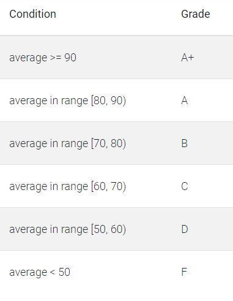

# Conditional Statement

## Java - IF - (Condition Statement)

`XYZ` school had conducted the annual examination for the 5th Standard class and they want to calculate the grade for the students who all attended in the annual examination. Each student has 5 subject marks. Let's help them to calculate the grade for the students.

Define a function called `calculateGrade` which takes a parameter. The first parameter is `students_marks` as a 2D array. `The function definition code stub is given in the editor. Calculate grade for all students given in the list, store into the list, and return it.

Steps to calculate the grade for students:

- Iterate each student, calculate the average score, and find the grade based on the average of a student.

- Store the grade for each student into an array, and return it.

**Grade Table:**

**Input Format Format for Custom Testing**

- In the first line m given, denotes m students
- In the second line n given, denotes n subjects.
- Next m lines n column students_marks given, denotes m students with their n subjects marks.

**Sample Case**

**Sample Input**

| STDIN          |     | Function                                             |
| -------------- | --- | ---------------------------------------------------- |
| 2              | →   | number of rows in students_marks[] n = 2             |
| 5              | →   | number of columns in students_marks[] m = 5          |
| 66 61 88 26 13 | →   | first row of students_marks[] = [66, 61, 88, 26, 13] |
| 52 38 7 74 62  | →   | second row of students_marks[] = [52, 38, 7, 74, 62] |

**Sample Output**

D
F

**Explanation:**

Each row to be considered as individual student marks, Each row to be considered as each subject. Each student has only 5 subjects.

Calculate the avg score and grade for each student:

first row of students_marks[] = [66, 61, 88, 26, 13], avg = 50.8, grade = 'D' (Based on the grade table given above)

second row of students_marks[] = [52, 38, 7, 74, 62], avg = 46.6, grade = 'F' (Based on the grade table given above)
